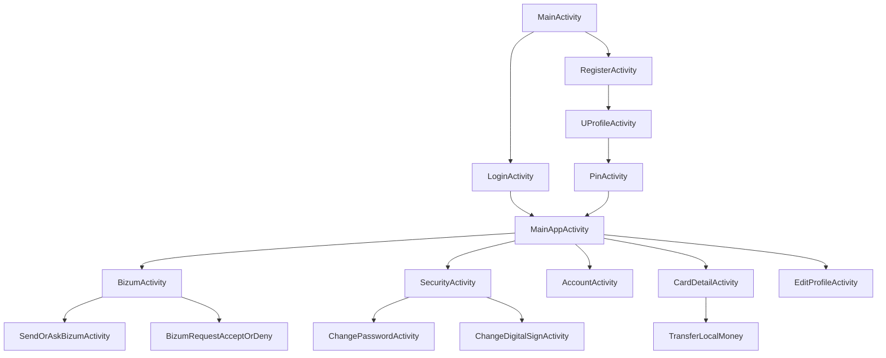

<h1 align="center"> Fortune </h1>  

  

  Fortune, the future of your finances.

  

<!-- START doctoc generated TOC please keep comment here to allow auto update -->
<!-- DON'T EDIT THIS SECTION, INSTEAD RE-RUN doctoc TO UPDATE -->
## Table of Contents

- [Introduction](#introduction)
- [Core Features](#core-features)
- [Application Architecture](#application-architecture)
- [Navigation Structure](#navigation-structure)
- [Technology Stack](#technology-stack)
- [Authentication and Security](#authentication-and-security)
- [Feedback](#feedback)
- [Acknowledgments](#acknowledgments)

<!-- END doctoc generated TOC please keep comment here to allow auto update -->

## Introduction

Fortune is a modern Android banking application developed in Kotlin. It empowers users to manage their financial operations securely and intuitively — including card management, Bizum payments, transfers, and account/profile settings.

**Available on Android.**

  

## Core Features

Fortune provides a full suite of banking functionalities:

- 💸 Send and request money with Bizum
- 💳 Manage and view debit/credit cards
- 🔐 Modify passwords, PINs, and secure access
- 👤 Edit personal profile information
- 📈 Access account balance and transactions
- 🔁 Perform card-to-card transfers

  

## Application Architecture

Fortune follows a clean MVVM (Model-View-ViewModel) architecture with dependency injection via **Hilt**.

### Activity Overview

| Activity | Purpose |
|----------|---------|
| `MainActivity` | App Entry Point |
| `LoginActivity`, `RegisterActivity` | User Authentication |
| `MainAppActivity` | Central Banking Hub |
| `CardDetailActivity`, `TransferLocalMoney` | Card Management |
| `BizumActivity`, `SendOrAskBizumActivity` | Bizum Payments |
| `SecurityActivity`, `ChangePasswordActivity`, `ChangeDigitalSignActivity` | Security Settings |
| `EditProfileActivity`, `UProfileActivity` | Profile Management |
| `AccountActivity` | Balance & Transactions |
| `BizumRequestAcceptOrDeny` | Manage Requests |

## Navigation Structure

Navigation is centered around `MainAppActivity`:

- **Profile Header**: Name and profile image
- **Balance Display**: Total account balance
- **Quick Actions**: Add money, make Bizum, manage security
- **Card Section**: RecyclerView with card previews
- **Fast Contacts**: RecyclerView with frequent Bizum contacts
- **Bottom Navigation**: Quick access to key modules
- **Slide Menu**: Extended features and profile access

## Technology Stack

| Category | Technology |
|----------|------------|
| Language | Kotlin |
| Architecture | MVVM |
| Dependency Injection | Hilt |
| UI | Android Views + Material Components |
| Networking | REST API |
| State Management | ViewModel + LiveData |
| Storage | JWT via `TokenManager` with SharedPreferences |

Notable Components:

- `RecyclerView`, `BottomNavigationView`, `NavigationView`
- `TextInputLayout`, `DrawerLayout`, `ImageView`, `LiveData`
- `TokenManager`: for secure token handling

## Authentication and Security

Fortune uses **token-based authentication** and requires a **digital signature PIN** for sensitive actions.

### Flow Overview:

## Acknowledgments

This project was made possible thanks to the support and resources provided by:

- [JetBrains](https://www.jetbrains.com/) for Kotlin and IntelliJ IDEA  
- [Android Developers](https://developer.android.com/) for documentation and development tools  
- [JWT.io](https://jwt.io/) for insights and utilities related to JSON Web Tokens
